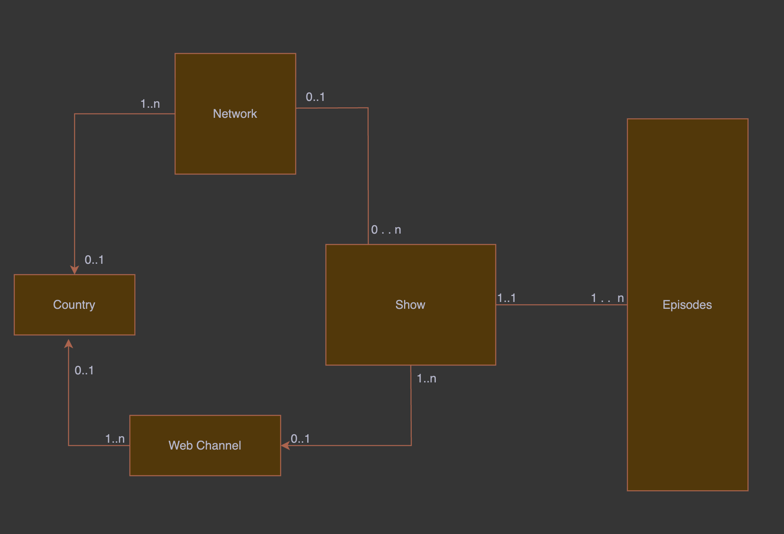

# looperinsights-assignment
A Ruby Application to scrap upcoming tv shows data for the next 90 days with good coding practices. It Transforms the data in the below Schema Format.



## Design Choices in database and Ingestion Pipeline:

- The database schema is as follows, instead of doing a type on the distributor , we wanted their ids to be very accessible and might overlap as we wouldnt know if TvMaze is storing them in a single table or differnt table. Hence two tables. Though processing uses the type mechanism to parse country and populate network,web channels from the incoming data
- The builder pattern is utilized in the ingestion pipelines, starting from the most smallest or independent object the objects are populated. The insertion order is Country, Network/WebChannel, Show and then lastly the Episodes.
- The RawTvData Table is utilized to ensure that the original data pulled and stored for later uses for cross verification or for mining or any analysis. Also this table can be archived over time and would be acting as a Cold Storage in most cases.
- The job TransformDataJob is designed with the principle of **fault tolerance** and **idompotence**, this is to ensure that if the ingestion fails during transformation , we have automatic retries with a exponential fallback. Also the idompotence principle is utilised to prevent ingestion of duplicate records into the database.
- For optimal and efficient performance , *upsert_all* is used rather than create , so mimicking bulk create. Also the upsert overrides rails model validations checks and saves us time. Only the database constraints would need to be honoured.
- The time complexity of ingesting n-records would be O(4n) as we need to build the four entities.


# Local Docker Setup / Initialization
- Ensure docker-compose command is installed and working.
- utilise the command ``` docker-compose -f docker-compose-local.yml up -d ```

# Docker Local Services
- Database (PostgreQL15)
- Redis (needed for sidekiq)
- Rails API server 
- Sidekiq Server (To run background jobs via cron scheduler automatically)

# Sample REST Endpoints with Ransack for Aggegration and Filteration

- For Getting TOP 10 rated shows which are releasing new episodes on a given date:
    SampleURL: ``` http://localhost:3000/episodes?q[airdate_eq]=2025-05-22&q[show_avg_rating_not_null]=1&q[s]=show_avg_rating+desc&page=1&per_page=10 ```
    
    Notes: Pagination and filteration and inner nested show_avg_rating is used for sorting and filteration of non null values. The pagination is used to achieve the TOP 10 filteration when paired with sorting.
- For Getting a particular title with a word "After"
    SampleURL: ``` http://localhost:3000/episodes?q[name_cont]=After&page=1&per_page=10 ```
    Notes: q[attributename_cont] means contains and leads to filteration of results (searching). This can be utilised also in Nested attributes which we will see a soon.

- For Searching Shows from a Particular Network such as CBS
    SampleURL: ``` http://localhost:3000/shows/query?q[network_name]=CBS ```
    Notes: Nested Attributes are also enabled in search hence it does automatic look up of necessary tables and filters the results
- For Searching or multi matching genres, to find all shows which has genre Comedy,Music
    SampleURL: ```http://localhost:3000/shows/query?q[genres_array_contains_all]=Comedy,Music```
    Notes: For Array serach we have added scope, if the attribute is a special such as jsonb or array then scopes are added to facilitate smooth searching.
- For Searching genres along with chained queries in name matching
    SampleURL: ```http://localhost:3000/shows/query?q[genres_array_contains_all]=Comedy,Music&q[name_cont]=After```
    Notes: Any number of chaining of attributes or nested attributes along with sorting is possible. The Pagination also is customizable and has default values when not provided.

- For more documentation of ransack and its abilities visit [ransack-documentation](https://activerecord-hackery.github.io/ransack/)

# Deployment Design

- The application has mainly 4 components.
ECS - To deploy rails docker images behind and ALB for load balancing.
Sidekiq Containers - Fixed Count as per the business domain knowledge
RDS - PostgreQL (Read Optimized + 99.9% Availability)
Redis Server
[GitHub] --> [CodePipeline + CodeBuild] --> [ECR] --> [ECS]
                                                    |
                                                    +---> [ALB] ---> [Rails API Containers]
                                                    |
                                                    +---> [Sidekiq Containers]
                                                    |
                                                    +---> [RDS (PostgreSQL) + Read Replica]
                                                    |
                                                    +---> [ElastiCache (Redis)]